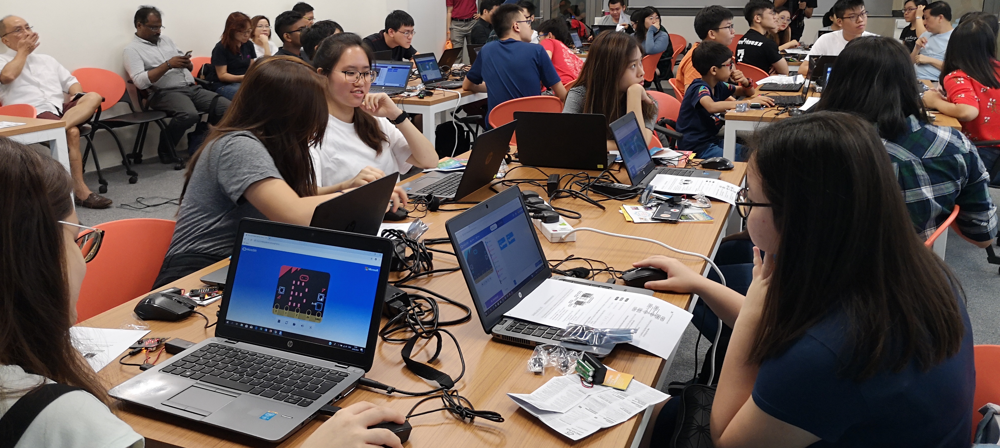

# About 3DC

**Digital Design & Development Club (3DC)** is an official [*Fifth-Row*](https://www.sutd.edu.sg/Campus-Life/Student-Life/Student-Organisations-Fifth-Row) club affilliated with [*ISTD Pillar*](https://istd.sutd.edu.sg/) at [*SUTD*](https://www.sutd.edu.sg/). We are also a [*Developer Student Club (DSC)*](https://dsc.community.dev/) supported by Google and a member of the *[OpenNodes](https://opennodes.com/) Campus Collective*.

Stay connected:

- Telegram Community: [3DC Family](https://t.me/joinchat/C_Nni1C77ZlOVTdjU4yf4Q)
- YouTube Channel: [SUTD 3DC](https://www.youtube.com/channel/UCF56lQD1HWv-0uOQSXrTmLw)
- Instagram: [@sutd3dc](https://www.instagram.com/sutd3dc/)
- Twitch: [www.twitch.tv/3dcdsc](https://www.twitch.tv/3dcdsc)
- GitHub: [github.com/3DCdsc](https://github.com/3DCdsc)

## Collaboration with Google

Developer Student Clubs are university based community groups for students interested in Google developer technologies. Students from all undergraduate or graduate programs with an interest in growing as a developer are welcome. By joining a DSC, students grow their knowledge in a peer-to-peer learning environment and build solutions for local businesses and their community.

In short, DSC is a worldwide community supported by Google. Our 3DC DSC at SUTD is proud to be a part of this community. We are seeking to empower students in their journey of undergraduate/graduate education. By joining our DSC, students will be able to build up their professional and personal skills, get access to Google Developer resources, and work together to build solutions for local problems in a peer-to-peer learning environment.

> Disclaimer: DSC@SUTD is an independent group; the activities and opinions expressed by the group should in no way be linked to Google, the corporation.

## Collaboration with OpenNodes

OpenNodes is an initiative started by Tribe and IMDA Singapore, and is supported by more than 30 leading global corporates and government agencies with 3DC running SUTD’s branch of Opennodes. The aim is to foster greater collaboration between various stakeholders within the tech ecosystem.

OpenNodes Campus Collective is an extension of these efforts, and will be the first time students from various universities across Singapore will be brought together for career opportunities and education resources. Opennodes connects students with projects from companies like IBM and WeBank to give students industry exposure. It will also be pushing out educational workshops for students to learn technical and consulting skills.

For more information on ongoing projects and news, please visit this [website](https://campus.opennodes.com/)

## Collaboration with ISTD

We are the only *Fifth-Row* under ISTD pillar, we organise events in collaboration with ISTD at i3 Lab (Building 1, Level 6).
